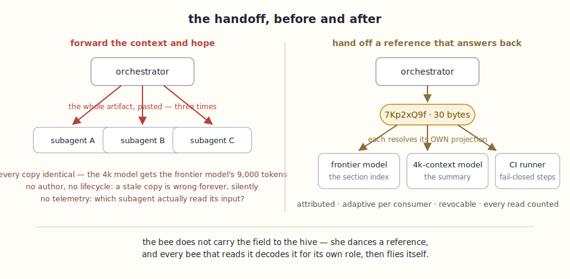
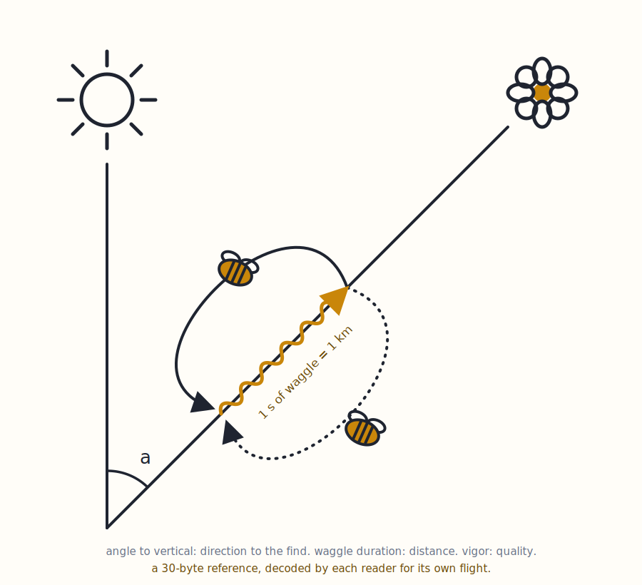
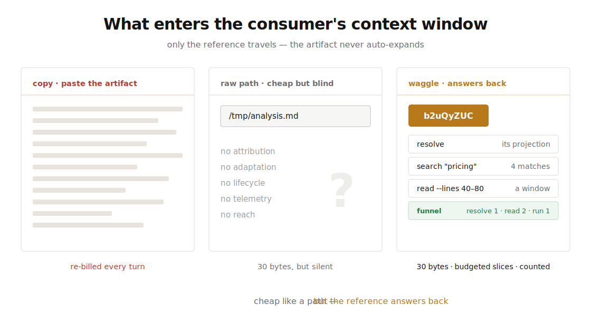
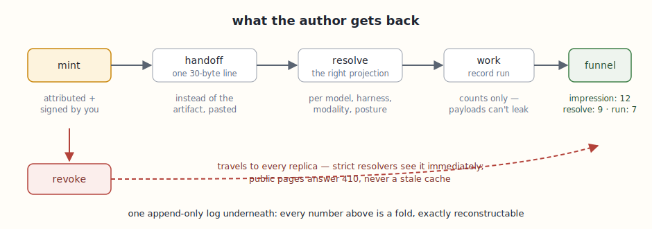
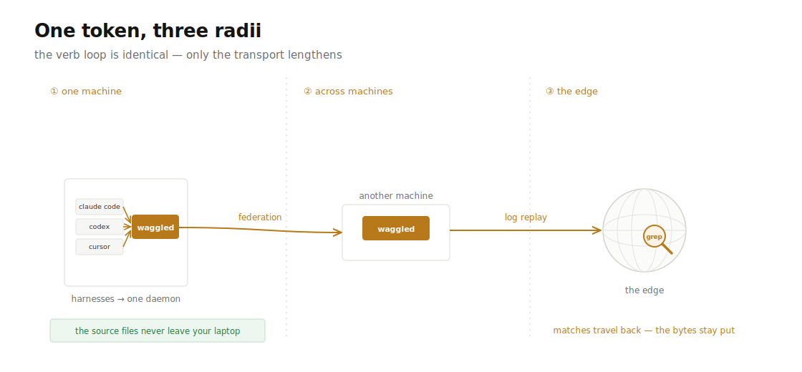

<h1 align="center">
   waggle
</h1>

<p align="center">
  <em>Tracked file paths for agents.</em><br>
  You already hand subagents <code>/tmp/result.md</code> — waggle makes that
  reference attributed, resolvable from any harness, revocable, and counted.
</p>

<p align="center">
  <a href="#the-dance">Why "waggle"</a> ·
  <a href="#the-problem">The problem</a> ·
  <a href="#how-it-works">How it works</a> ·
  <a href="#the-sixty-second-demo">The demo</a> ·
  <a href="#wiring-it-into-claude-code-codex--cursor">Harness setup</a> ·
  <a href="#status">Status</a> ·
  <a href="docs/README.md">All docs</a>
</p>

<p align="center">
  
</p>

## The dance

A honeybee returns from a find. On the vertical comb, in the dark, she
performs a figure-eight dance — the **waggle dance** — whose angle encodes
direction, whose duration encodes distance, whose vigor encodes quality.
She does not carry the field to the hive. She carries a **reference**.

And here is the part that matters: every bee that reads the dance decodes it
**according to its own role and state**, then flies to the target itself.
One shared marker. Adaptive interpretation per consumer. Recruitment success
observable at the hive.

<p align="center">
  
</p>

Twenty million years before context windows, evolution solved the handoff
problem — and it did not solve it by pasting the meadow into the prompt.

## The problem

We are entering the world of agent harnesses: Claude Code orchestrators
fanning out hundreds of subagents, Codex sessions delegating in parallel,
cross-vendor agents discovering each other over open protocols. And every
one of these handoffs, today, works the same way: **forward the context and
hope**.

The costs are measured, not hypothetical. Multi-agent systems consume ~15x
the tokens of a chat session — with the overhead attributed by the vendor
itself to *"duplicating context across agents, coordination messages between
agents, and summarizing results for handoffs."* Their words: **"Each handoff
loses context."** Roughly 37% of multi-agent failures trace to exactly this
seam.

Waggle's competitor is not another protocol. It is
`"Here's /tmp/analysis.md. Use it."` — and that instinct is *correct*: a
path is a 30-byte reference, which is exactly the right size for a
handoff. But a path has **no attribution** (who made this,
from what), **no adaptation** (the 4k-context model gets the same 9,000
tokens as the frontier model), **no lifecycle** (a stale path silently
serves wrong data forever), **no telemetry** (which subagent actually read
its input? which stalled?), and **no reach** (it dies at the machine
boundary).

> The long-form grounding — the handoff matrix across all four agent
> boundaries, the why-provider-caching-doesn't-transfer argument, and
> the full dance-to-design mapping — is **[docs/WHY.md](docs/WHY.md)**.

## What enters the context window

When a parent hands a subagent `/tmp/result.md` — or a waggle token —
only that *string* enters the subagent's context. The artifact behind it
does not travel unless something fetches it. Every harness answers
"fetch when?" differently: Claude Code subagents start fresh and gather
context themselves; OpenAI SDK handoffs forward conversation history
unless filtered; MCP resources enter only when the host reads them.
Three patterns, one gap:

<p align="center">
  
</p>

Waggle standardizes the third pattern, and enforces its one hard rule
**by type**: the token travels in context; the artifact never
auto-expands; `resolve`, `read`, and `search` return only the projection
or slice the consumer asked for, under byte budgets. Cheap like a path —
but the reference answers back.

## How it works

Waggle is the reference, made first-class. A **token** is a ~30-byte
attributed name for an artifact, minted in one call. Behind it, an
**attribution manifest**: who minted it (Ed25519-signed when the host
holds an identity), for which channel, from which parent (delegation
forms a lineage tree), with **variants** — different projections for
different consumers. When an agent resolves the token it presents its
context, and a **sealed, deterministic matcher** returns *its*
projection. Everything that happens afterward is an event in an
append-only log — payload-free by construction, so funnels count without
ever seeing your data.

<p align="center">
  
</p>

The reference doesn't stop at the process boundary. Every harness on a
machine shares one daemon; daemons federate across machines; and the
same tokens graduate to Cloudflare's edge by **replaying the log** —
migration is a stream, because the log is the truth. Pinned snapshots
replicate with the records, so `search` greps *at the edge* against
content whose source file never left your laptop.

<p align="center">
  
</p>

**Consumption is protocol-shaped**: waggle is an MCP server. One config line
in Claude Code, Codex, Cursor, or anything MCP-speaking — no SDK, no
language bindings, no accounts. Locally it is one binary and a SQLite
file.

## The sixty-second demo

Install once (every harness on the machine shares the same daemon and
the same tokens):

```bash
cargo install waggle-cli                          # on crates.io
claude mcp add waggle -- waggle serve --stdio     # ...and the same line in Codex/Cursor
waggle init                                       # the 5-line stub, into CLAUDE.md/AGENTS.md
```

**1 — mint.** In your Claude Code session (or by hand):

```bash
waggle mint --target "file://$PWD/q3-report.md" --snapshot
#  → { "token": "b2uQyZUC",
#      "handoff": "resolve b2uQyZUC via waggle for your working context" }
```

**2 — hand off that one line.** To a Codex session, a Cursor agent, a
teammate — instead of the file's contents.

**3 — the other side works, surgically.** No re-paste, no re-upload;
`--snapshot` pinned the bytes, so this works even after the file changes
or from a machine that never had it:

```bash
waggle resolve --token b2uQyZUC                    # its own projection, signed-by reported
waggle search  --token b2uQyZUC --pattern "pricing"  # grep THROUGH the token — matches travel, the file stays
waggle read    --token b2uQyZUC --lines 40-80      # a window, never the whole artifact
```

**4 — you stay in control.** Found an error in the report? The
correction reaches every holder of the token — including caches and
public pages, which answer 410:

```bash
waggle mutate --token b2uQyZUC --change revoke --expected-version 1
```

**5 — and you can *see* the handoff working:**

```bash
waggle funnel --token b2uQyZUC
#  { "resolve": 1, "read": 2, "run": 1 }   ← it resolved, searched twice, ran with it
```

That's the product. Counts only — the funnel never sees content.
`just demo` runs the whole arc live against a throwaway store.

When the handoff must outlive your laptop, one deploy
([guide 09](docs/guide/09-the-edge.md)) and one command:

```bash
waggle edge push     # records + snapshots replicate; the FILES never leave
waggle edge status   # {"health":"ok","tools":9}
```

Every response carries executable `next` steps; `waggle map` answers
"where am I?" live. The **[documentation map](docs/README.md)** holds
the ten guides in reading order — from the five-minute loop to minting
on a laptop and grepping on Cloudflare.

## Wiring it into Claude Code, Codex & Cursor

Two things make a harness waggle-fluent: the **MCP server** (the tools)
and the **convention-file stub** (the one standing instruction). Both
are one command each.

**Claude Code**

```bash
claude mcp add waggle -- waggle serve --stdio
waggle init        # in each repo where agents work
```

**Codex** — add to `~/.codex/config.toml` (AGENTS.md is covered by the
same `waggle init`):

```toml
[mcp_servers.waggle]
command = "waggle"
args = ["serve", "--stdio"]
```

**Cursor** — add to `.cursor/mcp.json` (`.cursorrules` is covered by
`waggle init`):

```json
{ "mcpServers": { "waggle": { "command": "waggle", "args": ["serve", "--stdio"] } } }
```

All three land on the **same daemon and the same tokens** — what a
Claude Code session mints, a Codex session resolves.

### How the agents get instructed

`waggle init` writes this stub into `CLAUDE.md`, `AGENTS.md`, and
`.cursorrules` (idempotent — it manages its own marked block):

```markdown
## Artifact handoffs (waggle)
When passing work products between agents or subagents, do not paste file
contents. Call waggle's `mint` with the artifact's path and hand over the
`handoff` line from the result. Consumers call `resolve` with the token.
When minting a binary artifact (PDF, image, audio), extract its text with
your own abilities first and pass it via `content`.
If unsure what to do with a token, call `map`.
```

That is the **entire** standing instruction — deliberately. Everything
else is taught in-band, at the moment it's needed: every tool response
carries up to three executable `next` steps, and `map` answers "where am
I, what are my paths?" computed live from actual state. Instructions in
convention files rot; envelopes can't.

**The orchestrator pattern**, in practice: when you (or your top-level
agent) delegate, the subagent's prompt contains the handoff line and
nothing else about the artifact —

> Your working context: **resolve b2uQyZUC via waggle**. Use waggle's
> `search`/`read` to pull only the slices you need; call
> `record --stage run` when you've used it.

The subagent finds the tools already mounted, pulls its own projection,
and the funnel shows you it happened. (This exact flow — orchestrator
mints, a fresh subagent answers a research question through the token
alone, funnel reads `{resolve: 1, read: 5, run: 1}` — is how this repo
dogfoods itself.)

| Crate | Role |
|---|---|
| `waggle-core` | sans-I/O domain: tokens, manifests, matcher, log, trust |
| `waggle-ops` | the operations catalog — one source, four projections |
| `waggle-agent` | resolver-context extraction (harness metadata, A2A cards) |
| `waggle-social` | the human face: unfurls, share packages, QR |
| `waggle-store*` | the storage contract + SQLite/JSONL/Cloudflare backends |
| `waggle-mcp` | the MCP projection: tool schemas, envelope, transports |
| `waggle-cli` | `waggle` verbs + `waggled`, the local daemon |

```bash
just dev-install   # build & install the CLI from this checkout
just preflight     # fmt-check · clippy -D warnings · file-size lint · tests · wasm
```

## What makes it credible

This repository is design-first and unusually explicit about its own
discipline — the [design docs](docs/design/) are the contract, and the
[**specification**](spec/waggle-spec.md) with its
[conformance vectors](spec/vectors/) is the portable half (the vectors
are generated FROM the implementation and drift-checked in CI — an
independent implementation that matches them is a waggle
implementation):

- **Sans-I/O core** — no clock, no entropy, no storage in the domain crates;
  every effect is a parameter. The same code runs in the native daemon and
  in Workers wasm, and every function is deterministic under test.
- **Deterministic adaptivity** — same context, same projection, always;
  the variant matcher is sealed so the trust claim survives.
- **Event-sourced with a reconstruct guarantee** — counters are cache; the
  log is truth; replay-equivalence is a CI property, not a slogan.
- **One operations catalog** — the MCP tools, the clap CLI, the `map`
  navigation, and `COMMANDS.md` are four projections of one table, with
  parity tests that fail the build on drift. The tools teach the agent
  themselves (`map`: *"I am here — what are my forward and reverse paths?"*)
  so instruction cannot rot the way skills do.
- **Verified against real infrastructure** — the edge tier shipped against
  a published completeness matrix; a differential oracle holds the edge
  byte-identical to SQLite over the same operations; and the end-to-end
  walkthrough on a real Cloudflare account caught (and fixed, and
  regression-locked) a cache-invalidation bug no local tier could see.

## Status

**v0.1.0 on [crates.io](https://crates.io/crates/waggle-cli)**; the 0.3
feature set is complete on `main` and every claim is a passing test in CI
(three-OS matrix + wasm + the live Miniflare edge matrix; ~170 tests):

- **the full loop** — mint / resolve / record / mutate / funnel / read /
  search / query / map over MCP and CLI, one shared daemon per machine;
- **surgical content** — snapshots pinned content-addressed at mint;
  grep and windowed reads through the token under byte budgets;
- **federation** — daemon-to-daemon over TCP or HTTPS, strict vs
  eventual freshness, the CLI transparent through all tiers;
- **the edge** — a Durable Object per tenant running the same certified
  engine; `waggle edge push` replicates records and snapshots;
  resolve p50 1.2 ms through the full HTTP-worker-DO path;
- **trust** — Ed25519 signatures over the immutable core (mutations
  never invalidate, by construction); capability-URL private tokens;
- **the spec** — normative document plus conformance vectors generated
  from the implementation, drift-checked in CI;
- **measured, not promised** ([benches/PERF.md](benches/PERF.md)) —
  39 ns cache-hit resolves, 39 us durable appends (real fsync), a
  million-event funnel fold in 334 us.

## License

MIT OR Apache-2.0, at your option.

---

<p align="center">
  <em>She never carries the field home. She dances, and the hive knows.</em>
</p>
