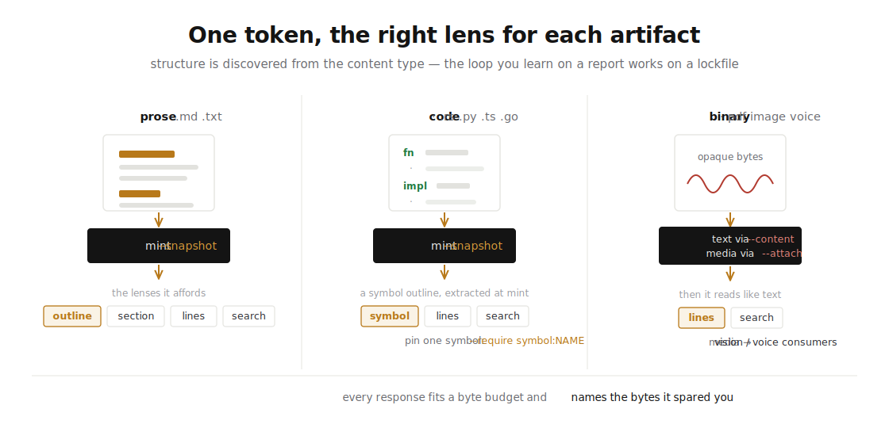

<h1 align="center">
   waggle
</h1>

<p align="center">
  <em>Tracked file paths for agents.</em><br>
  You already hand subagents <code>/tmp/result.md</code> — waggle makes that
  reference attributed, resolvable from any harness, revocable, and counted.
</p>

<p align="center">
  <a href="#the-problem">The problem</a> ·
  <a href="#how-it-works">How it works</a> ·
  <a href="#install">Install</a> ·
  <a href="#wire-it-into-your-harness">Harness setup</a> ·
  <a href="#by-file-type">By file type</a> ·
  <a href="#reach-local--machines--the-edge">Reach</a> ·
  <a href="#the-tmux-switchboard">Switchboard</a> ·
  <a href="docs/design/essay.md">The essay</a> ·
  <a href="paper/">The paper</a>
</p>

<p align="center">
  
</p>

## The problem

We are entering the world of agent harnesses: Claude Code orchestrators
fanning out subagents, Codex sessions delegating in parallel, cross-vendor
agents discovering each other over open protocols. And every one of these
handoffs, today, works the same way: **forward the context and hope.**

The costs are measured, not hypothetical. Multi-agent systems consume ~15×
the tokens of a chat session — the overhead attributed by the vendor itself
to *"duplicating context across agents… and summarizing results for
handoffs,"* whose one-line summary is **"each handoff loses context."**
Roughly 37% of multi-agent failures trace to exactly this seam.

Waggle's competitor is not another protocol. It is
`"Here's /tmp/analysis.md. Use it."` — and that instinct is *correct*: a
path is a 30-byte reference, which is exactly the right size for a handoff.
But a raw path has **no attribution** (who made this, from what), **no
adaptation** (the small-context model gets the same 9,000 tokens as the
frontier model), **no lifecycle** (a stale path silently serves wrong data
forever), **no telemetry** (which subagent actually read its input? which
stalled?), and **no reach** (it dies at the machine boundary).

<p align="center">
  
</p>

Only the *string* enters the consumer's context — the artifact behind it
never travels unless something fetches it. Waggle standardizes that third
pattern and enforces its one hard rule **by type**: the token travels; the
artifact never auto-expands; `resolve`, `read`, and `search` return only the
projection or slice the consumer asked for, under byte budgets. Cheap like a
path — but the reference answers back.

## How it works

A **token** is a ~30-byte attributed name for an artifact, minted in one
call. Behind it stands an **attribution manifest**: who minted it
(Ed25519-signed when the host holds an identity), for which channel, from
which parent (delegation forms a lineage tree), with **variants** —
different projections for different consumers. When an agent resolves the
token it presents its context, and a **sealed, deterministic matcher**
returns *its* projection. Everything afterward is an event in an
append-only log — payload-free by construction, so funnels count without
ever seeing your data.

<p align="center">
  
</p>

**Consumption is protocol-shaped**: waggle is an MCP server. One config line
in Claude Code, Codex, Cursor, or anything MCP-speaking — no SDK, no language
bindings, no accounts. Locally it is one binary and a SQLite file.

## Walk the handoff, in first person

The value isn't abstract. Stand in each role and it's obvious.

**You are the orchestrator.** You just wrote a plan and spawned three
subagents. Today you paste the plan into each prompt — three copies,
re-billed every turn, and afterward you have no idea which one actually
read it. With waggle you hand each the same 30-byte line. When they
return, the funnel shows two resolved and read it, one never opened it —
and you catch the bluff *before* you trust its answer. Found a bug in the
plan? One revoke, and the correction reaches all three.

**You are the subagent.** You wake up with one line: `resolve b2uQyZUC`.
You resolve it into a digest shaped for *your* model, an outline so you
know what's inside before you read, and `next` steps pointing you where to
look. You grep for the one fact you need and pull 200 bytes — not the
9,000-token plan. You never ingest what you didn't need.

**Now the subagent moves to another machine.** Nothing changes. The same
line, the same resolve, the same grep — the bytes stay on the
orchestrator's laptop, only the matches travel back. The loop you learned
in one process is byte-for-byte the loop across the network.

**And this can't live inside a harness.** Claude Code could build clever
handoffs — but that cleverness would die at its boundary; a Codex subagent
couldn't see it, and the orchestrator's memory of who made what, and who
read it, would be prose in one harness's context, gone at the next
compaction. The reference layer has to sit *outside* any single harness — a
neutral substrate every harness speaks in one line — so what Claude Code
mints, Codex resolves, and the receipt survives them both. Handoffs are a
distributed-systems problem; solving them inside one vendor's harness logic
is solving them in the one place they can't be solved.

## Install

Pick one — all install the same `waggle` binary:

```bash
cargo install waggle-cli                          # from crates.io

# ...or a prebuilt binary, no Rust toolchain needed:
curl --proto '=https' --tlsv1.2 -LsSf \
  https://github.com/modiqo/waggle/releases/latest/download/waggle-cli-installer.sh | sh

# ...or Homebrew:
brew install modiqo/homebrew-tap/waggle-cli
```

The store lives at `~/.waggle/waggle.db` (SQLite, WAL); blobs sit beside it.
`waggle daemon status` shows uptime, connections, and disk weight.

## Wire it into your harness

Two things make a harness waggle-fluent: the **MCP server** (the tools) and
the **convention-file stub** (the one standing instruction). Each is one
command. All three land on the **same daemon and the same tokens** — what a
Claude Code session mints, a Codex session resolves.

**Claude Code**

```bash
claude mcp add waggle -- waggle serve --stdio
waggle init        # in each repo where agents work
```

**Codex** — add to `~/.codex/config.toml`:

```toml
[mcp_servers.waggle]
command = "waggle"
args = ["serve", "--stdio"]
```

**Cursor** — add to `.cursor/mcp.json`:

```json
{ "mcpServers": { "waggle": { "command": "waggle", "args": ["serve", "--stdio"] } } }
```

`waggle init` writes a short stub into `CLAUDE.md`, `AGENTS.md`, and
`.cursorrules` (idempotent — it manages its own marked block). That stub is
the **entire** standing instruction; everything else is taught in-band —
every tool response carries up to three executable `next` steps, and `map`
answers *"where am I, what are my paths?"* computed live from state.
Instructions in convention files rot; envelopes can't.

**The orchestrator pattern**, in practice: when you delegate, the subagent's
prompt contains the handoff line and nothing else about the artifact —

> Your working context: **resolve `b2uQyZUC` via waggle**. Use `search`/`read`
> to pull only the slices you need; call `record --stage run` when you've
> used it.

The subagent finds the tools already mounted, pulls its own projection, and
the funnel shows you it happened.

## By file type

The lens engine is text-first, not markdown-first — structure is discovered
from the content type, so the loop you learn on a report works on a lockfile.

<p align="center">
  
</p>

**Prose** — mint with `--snapshot` to pin the bytes; consumers get the
outline, sections, line windows, and grep:

```bash
waggle mint --target "file://$PWD/q3-report.md" --snapshot
waggle read   --token b2uQyZUC --section "Competitor Pricing"
waggle search --token b2uQyZUC --pattern "pricing"     # matches travel, the file stays
```

**Source code** — `--snapshot` also runs tree-sitter at mint and stores a
**symbol outline** beside the bytes. The consumer orients before it greps,
reads a definition by name, and you can declare — and *prove* — what a
reviewer had to reach:

```bash
waggle mint --target "file://$PWD/src/contract.rs" --snapshot \
    --require symbol:evaluate                 # a consumption contract, signed at mint
waggle read     --token 9u6KEr6F              # overview: the symbol table of contents
waggle read     --token 9u6KEr6F --symbol evaluate   # the exact definition, no window guessing
waggle coverage --token 9u6KEr6F              # { met: true }  ← the required region was reached
```

Symbols work for Rust, Python, TypeScript/JavaScript, and Go; other text
keeps the full line/search loop. Extraction happens only at mint — no parser
ever runs on a serving path, including the edge.

**Binaries (PDF, image, voice)** — extract the text with your own abilities
and pass it via `--content`, or attach the media so vision/voice consumers
receive it while everyone else falls through to the catch-all:

```bash
waggle mint --target "file://$PWD/deck.pdf"   --content ./deck.txt      # searchable text
waggle mint --target "file://$PWD/memo.m4a"   --attach  ./memo.m4a      # audio → listeners
```

## Reach: local → machines → the edge

The reference doesn't stop at the process boundary. Every harness on a
machine shares one daemon; daemons federate across machines; and the same
tokens graduate to Cloudflare's edge by **replaying the log** — migration is
a stream, because the log is the truth. Pinned snapshots replicate with the
records, so `search` greps *at the edge* against content whose source file
never left your laptop.

<p align="center">
  
</p>

When the handoff must outlive your laptop, deploy once
([guide 09](docs/guide/09-the-edge.md)) and push:

```bash
npx wrangler deploy               # a Durable Object per tenant, same certified engine
waggle edge push                  # records + snapshots replicate; the FILES never leave
waggle edge status                # { "health": "ok", "tools": 9 }
waggle edge smoke                 # proof loop: mint → resolve → funnel, at the edge
```

The CLI is transparent through all three tiers — an agent's loop (mint, hand
off, resolve, interrogate, report) is byte-for-byte the same whether the
other end is in this process, on another machine, or on another continent.

## The tmux switchboard

For the full multi-harness experience, `waggle-tmux` turns handoffs into the
interface itself ([guide 11](docs/guide/11-tmux-switchboard.md)):

```bash
cargo install --path crates/waggle-tmux         # ships with the repo
waggle-tmux up claude-code codex                # choose once — everything wires itself
```

One window per harness (the tmux bar is your harness switcher), a live
lineage board under each, and when an agent finishes it mints its outcome to
`tmux/<destination>` — your screen **swaps** to that harness with the resolve
instruction typing itself. Receipts on the board, `/exit` handled gracefully,
`--seal` when the review must be provable.

## What makes it credible

This repository is design-first and unusually explicit about its own
discipline — the [design docs](docs/design/) are the contract, and the
[**specification**](spec/waggle-spec.md) with its
[conformance vectors](spec/vectors/) is the portable half (generated FROM the
implementation and drift-checked in CI — an independent implementation that
matches them is a waggle implementation):

- **Sans-I/O core** — no clock, no entropy, no storage in the domain crates;
  every effect is a parameter. The same code runs in the native daemon and in
  Workers wasm, deterministic under test.
- **Deterministic adaptivity** — same context, same projection, always; the
  variant matcher is sealed so the trust claim survives.
- **Event-sourced with a reconstruct guarantee** — counters are cache; the log
  is truth; replay-equivalence is a CI property, not a slogan.
- **One operations catalog** — the MCP tools, the clap CLI, the `map`
  navigation, and `COMMANDS.md` are four projections of one table, with parity
  tests that fail the build on drift.
- **Verified against real infrastructure** — a differential oracle holds the
  edge byte-identical to SQLite over the same operations, on a real Cloudflare
  account.

## Status

**v0.4.0 on [crates.io](https://crates.io/crates/waggle)** — the full feature
set, every claim a passing test in CI (three-OS matrix + wasm + the live
Miniflare edge matrix):

- **the full loop** — mint / resolve / record / mutate / funnel / read /
  search / query / map over MCP and CLI, one shared daemon per machine;
- **surgical content** — snapshots pinned content-addressed at mint; grep and
  windowed reads through the token under byte budgets;
- **receipts** — consumption contracts (`--require`), coverage with misses
  named, `accepted`/`rejected` outcomes, and an escalation choreography;
- **the symbol lens** — mint-time tree-sitter outlines; `read --symbol`,
  `--require symbol:`, zero parsing on any serving path;
- **the resource projection** — MCP `resources/list`+`read`, and subscriptions
  that push lifecycle corrections to holders;
- **federation & the edge** — daemon-to-daemon; a Durable Object per tenant;
  resolve p50 1.2 ms through the full HTTP-worker-DO path;
- **trust** — Ed25519 over the immutable core; capability-URL private tokens;
- **measured, not promised** ([benches/PERF.md](benches/PERF.md)) — 39 ns
  cache-hit resolves, 39 µs durable appends, a million-event funnel fold in
  334 µs.

The **[documentation map](docs/README.md)** holds the guides in reading order;
the **[essay](docs/design/essay.md)** is why it's shaped this way, and the
**[paper](paper/)** is the systems treatment.

## License

MIT OR Apache-2.0, at your option.

---

<p align="center">
  <em>She never carries the field home. She dances, and the hive knows.</em>
</p>
