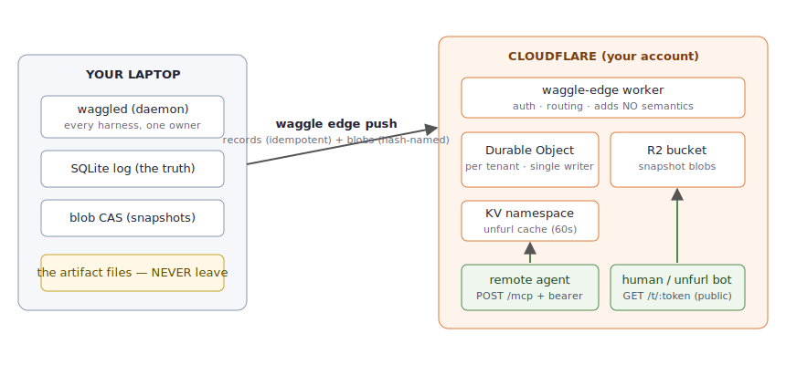
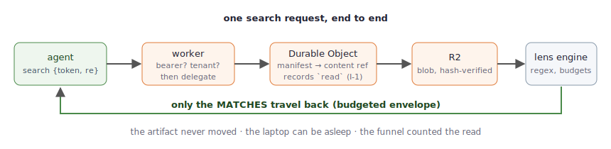

# The edge, walked through — every command, verified live

This is the complete record of taking one laptop's waggle store to
Cloudflare's edge and proving every promise on the way. **Every command
and output below was executed against a real account on 2026-07-08** —
including the bug the walkthrough itself caught (step 7).



## Step 0 · What you need

- A Cloudflare account (everything below fits the **free tier**)
- `npx wrangler login` (one-time browser OAuth)
- waggle installed (`cargo install waggle-cli`, or `just dev-install`)

## Step 1 · Create the two bindings (once)

```bash
cd edge-worker
npx wrangler kv namespace create CACHE
#   → paste the printed id into wrangler.toml's [[kv_namespaces]] entry
npx wrangler r2 bucket create waggle-blobs
```

KV caches unfurl pages; R2 holds snapshot blobs. Both are **optional**
— a worker deployed without them degrades to hints, never errors.

## Step 2 · The tenant bearer, then deploy

```bash
openssl rand -hex 24 | tee /dev/tty | npx wrangler secret put TENANT_TOKEN
npx wrangler deploy
#   Deployed waggle-edge …
#   https://waggle-edge.<you>.workers.dev
```

Save that hex string — it is the key to `/mcp` and `/store`.

## Step 3 · Point the CLI at it, verify

```bash
export WAGGLE_EDGE_URL=https://waggle-edge.<you>.workers.dev
export WAGGLE_EDGE_BEARER=<the hex string>

waggle edge status
# {"health":"ok","tools":9,"url":"https://waggle-edge.….workers.dev"}

waggle edge smoke
# {"funnel":{"resolve":1},"smoke":"ok","token":"9SpkQjWf"}
```

`smoke` just minted a token **on Cloudflare**, resolved it there, and
read its funnel back. The loop works before any of your data moves.

## Step 4 · Mint locally, with a snapshot

```bash
waggle mint --target "file://$PWD/q3-findings.md" --snapshot
# → token vDRVcdrR
```

`--snapshot` pins the file's bytes content-addressed into your local
blob store. This is the opt-in moment (guide 07): only snapshotted
content can ever travel.

## Step 5 · Push — the whole store, one command

```bash
waggle edge push
# {"records_scanned":1,"records_new":1,"blobs_pushed":1,
#  "hint":"rerun anytime — ingest is idempotent (C-4)"}
```

What happened, in order (blobs land **before** the manifests that
reference them, so the edge never advertises content it can't serve):

1. every snapshot blob → R2, named by its SHA-256;
2. every log record → the Durable Object via idempotent ingest —
   duplicates are free, so rerunning `push` is always safe;
3. the DO rebuilds its views from the records (R-4), so the edge's
   answers are *derived from the same log as yours*.

## Step 6 · The payoff — grep a laptop file, on Cloudflare

```bash
curl -s -X POST $WAGGLE_EDGE_URL/mcp \
  -H "authorization: Bearer $WAGGLE_EDGE_BEARER" \
  -d '{"jsonrpc":"2.0","id":1,"method":"tools/call","params":{
        "name":"search","arguments":{"token":"vDRVcdrR","pattern":"bespoke"}}}'
# → line 4: "Enterprise pricing is bespoke and gated."  (total: 1)
```



The file exists on one laptop, possibly asleep. The regex ran in
Cloudflare's runtime against the hash-verified R2 copy. Only the match
traveled. The public unfurl works too — `GET /t/vDRVcdrR` serves OG
meta from the mint snapshot (no auth: short links are for sharing) —
and each render records an `impression` in the funnel.

## Step 7 · Corrections travel — and the bug this step caught

```bash
waggle mutate --token vDRVcdrR --change revoke --expected-version 1
waggle edge push          # the revocation record replicates
curl -o /dev/null -w "%{http_code}" $WAGGLE_EDGE_URL/t/vDRVcdrR
# → 410 Gone
```

Honest footnote: **the first live run of this step returned 200.** The
resolve showed `revoked`, but the unfurl came from the KV cache — cache
invalidation watched `/mcp` mutate frames, and a revocation arriving by
*replication* slipped past it. The fix (invalidate on ingested mutation
records too) deployed within minutes, and the failure is now a
permanent row in the CI matrix (`E2-ingest`). End-to-end verification
against real infrastructure is the only tier that could have caught it.

## Step 8 · Read the receipts

```bash
curl … funnel {token}
# {"impression": 2, "read": 1, "resolve": 1}
```

Two unfurl renders, one edge-side grep (the `read`), one resolve —
counted at the edge, payload-free (I-1), and foldable back into your
local funnel the same way everything replicates: it's all one log.

## The mental model to keep

| | your laptop | the edge |
|---|---|---|
| owns | the log, the files, the blobs | replicas of records + snapshotted blobs only |
| writes | mint/mutate/record, then `push` | remote consumers' events |
| can vanish? | it's the source | delete the worker; the log replays home |

`push` is a **stream, not a sync protocol**: idempotent records +
content-addressed blobs mean there is no diffing, no conflict
resolution, no state machine — rerun it whenever, from however many
machines, and the destination converges (R-1/C-4, the same properties
CI proves on every commit).

## Teardown

```bash
npx wrangler delete            # the worker + DO
npx wrangler r2 bucket delete waggle-blobs
npx wrangler kv namespace delete --namespace-id <id>
```

Your data was never only there.
